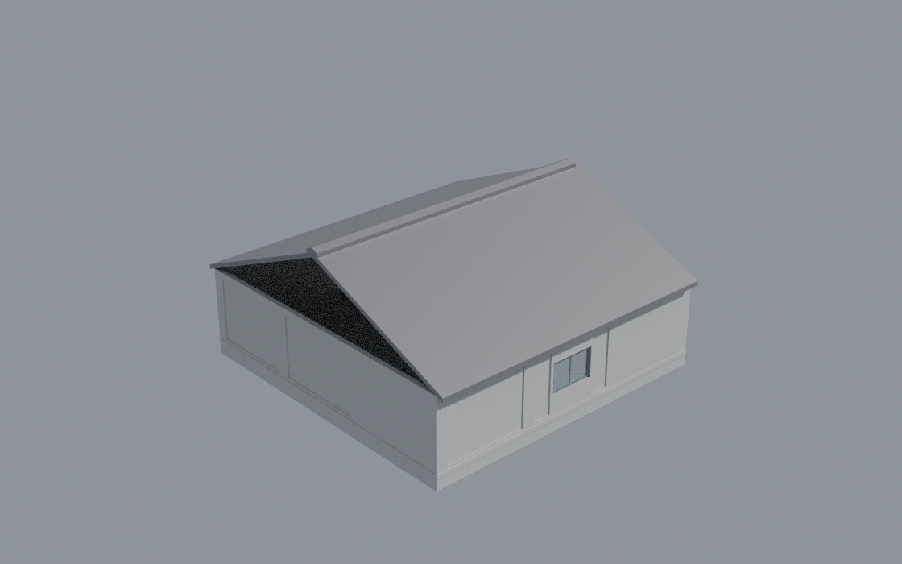
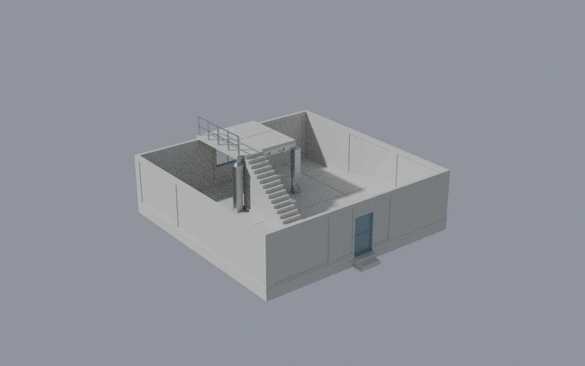

# Tessera

**An AI-readable world-building framework and original asset pack.**

[](LICENSE-CODE)
[](LICENSE-ASSETS)


**Tessera stops an agent guessing measurable placement facts. It does not stop
it guessing what world to build.**

That distinction is the honest version of this project and it is worth stating
before anything else, because an earlier draft of this README claimed the agent
"stops guessing" outright. It doesn't. An external evaluation put the correction
better than we had:

> Tessera stops an agent from guessing measurable placement facts. It does not
> yet stop the agent from guessing what world should be built.

What it *does* remove is the correction loop. The agent places a wall, renders
it, sees it floating, lowers it, renders again, notices the doorway is sealed by
auto-generated collision, and starts over. Every one of those round-trips is a
render, a screenshot, a visual estimate and a retry — and every one of them is
avoidable, because the answer was always a number somebody could have written
down.

Tessera removes that loop by shipping the *answers* alongside the assets — a
versioned, engine-neutral placement contract that states, per asset, exactly how
big it is, where its origin sits and why, which way it faces, what it may rest
on, how it connects to other pieces, what volume it occupies, what must stay
clear, and whether you can walk through it. Then it ships an executable
validator that checks a whole scene against that contract and returns, for every
problem, the exact correction to apply.

```
$ ./tessera validate --layout examples/workshop_shell/layout.json

ERROR   TSR_LAYOUT_FLOATING    Instance floats above its support.
        instance=wall_straight_4m_01 support=floor_slab_4m_02 position=[0.20, 4.00, 0.87]
        expected 0.5000   actual 0.8700
        why  A 0.3700 m gap between the asset and the highest surface beneath it.
             This is the single most common placement error and it is invisible
             from directly above.
        fix  lower by 0.3700 m
        apply {"translate": [0.0, 0.0, -0.37]}
```

The agent applies `fix_transform` and re-runs. It never renders anything.



*The Workshop Shell: 41 instances, every transform solved from the placement
contract, rendered with headless Blender by `tools/render_previews.py`.*

---

## The proof

The first milestone is a vertical slice, not a library. Twelve original parts,
assembled into a sealed workshop:

| Measured | Result |
|---|---|
| Instances in the demonstration scene | **41** |
| Placed by solving the contract | **41** |
| Placed by hand | **0** |
| Seams discovered automatically and verified | **46** |
| Manual placement corrections required | **0** |
| Validation errors in the finished scene | **0** |
| Layout rules with a test that breaks them | **15 / 15** |
| Asset rules with a test that breaks them | **12 / 12** |
| Assets whose mesh is independently verified watertight | **12 / 12** |
| Runtime dependencies | **0** |
| Catalog compressed for a constrained context | **~193 tokens per asset** |
| Reachability claims proven, not asserted | **4 / 4** |

`examples/workshop_shell/build.py` is 90 lines and contains exactly one
hard-coded height: the terrain, at zero. Every other Z, and every transform that
joins two pieces, is solved from the contract.

```bash
git clone https://github.com/JaronKBragg7337/tessera-worldkit
cd tessera-worldkit

./tessera build                                        # generate meshes + catalog
./tessera validate                                     # check every asset
python3 examples/workshop_shell/build.py               # assemble from metadata
./tessera validate --layout examples/workshop_shell/layout.json
```

No install step, no virtualenv, no Blender. The whole pipeline is standard
library Python 3.10+.

---

## It also fits on a phone

The full catalog is about 30,000 tokens for twelve assets, and it grows linearly
with the kit. That is fine for a desktop agent with a filesystem and impossible
for an assistant running inside a phone app, where the whole conversation may
have less budget than one kit.

```bash
./tessera brief --format text     # ~1,800 tokens
./tessera brief --format json     # ~2,400 tokens, 8% of the catalog
```

The brief is not a summary. It is the same facts with everything placement does
not use removed — occupancy boxes, collision hulls, materials, LODs, mesh
statistics, engine settings, provenance — and the parts that are identical
across every asset hoisted into a header. Dimensions, grounding offsets, grid
and rotation policy, support relations, full connector frames, apertures and
clearances all survive.

That it is *sufficient* is a test, not a claim: a 37-instance workshop is
assembled from a brief alone — the builder never sees the real catalog — and
then validated **against the full catalog**, with zero errors. If the digest
ever drops something placement depends on, that test fails.

Every catalog carries a `fingerprint`, and every layout records the one it was
composed against, so composing on one device and executing on another fails
loudly instead of producing a building full of gaps that nothing reports. See
[`docs/remote-agents.md`](docs/remote-agents.md).

None of this removes anything from an agent that *does* have a filesystem and an
engine. It is the same contract at two budgets.

---

## It has been tested on a model that could not run anything

DeepSeek was asked, from a phone chat with only this repository's URL, to build a
two-storey survivor safe house. No checkout, no terminal, no Python, no engine,
no connectors. It browsed GitHub as web pages and wrote a script.

It found the correct asset namespace and every id, used `Builder`, `ground()`,
`mate()` and `autoconnect()` correctly, and reproduced the shape of the worked
example. It did not invent coordinates or hallucinate asset names. Then it
claimed `Validation errors: 0` for a script it had just said it could not run.

The script has been run unchanged and repaired using **only validator output —
nothing was ever rendered or screenshotted**:

| Round | | Errors |
|---|---|---|
| 1 | ran unchanged | crash, with the six valid connectors named |
| 2 | one-line fix | **36** |
| 3 | removed two duplicate walls, moved a partition onto the grid | 28 |
| 4 | redesigned the second storey | 2 |
| 5 | shifted a partition one grid step | **0** |

Every structural defect a careful human reviewer found was caught, plus two the
reviewer missed. Two new validator rules exist *because* of this run — a 4 × 4 m
floor slab cantilevered off a single wall edge used to validate clean.

And the most useful finding was not an agent error at all:

> A second storey with interior access **cannot be built** from `shell_v1`. There
> is no stair, no ladder, no beam and no floor piece with an opening.

The stacked crates DeepSeek used as a staircase were a model routing around a
missing asset, producing geometry the validator accepts and a player cannot
climb. The repaired example builds what *is* expressible and says in its own
docstring what it did not build and why.



*The two-storey safe house: columns carrying a beam, a mezzanine, and a stair
that a flood fill proves a character can actually climb.*

Full log, classification and reproduction:
[`benchmarks/constrained_agent/`](benchmarks/constrained_agent/).

---

## What is in the box

**A geometry kernel** (`src/tessera/boxset.py`, `mesh.py`) that represents
solids as sets of disjoint axis-aligned boxes. Boolean operations are exact
lattice arithmetic, not a mesh solver, which means the pipeline runs anywhere —
including CI and an agent's sandbox — and it means the occupancy volume *is* the
solid rather than an approximation of it. Clash tests are exact.

**A placement contract** (`src/tessera/contract.py`,
[`schema/asset.schema.json`](schema/asset.schema.json)) covering stable ids,
semantic roles, provenance, units and axes, measured and grounded bounds, pivot
and its rationale, forward/up/right, allowed rotations and scaling, grid and
snap increments, connectors with normals *and tangents* and per-connector
tolerances, occupancy, clearance, apertures, collision, material slots, LOD
slots, engine import expectations, validation status and licence. Every
geometric field is measured at build time, so it cannot drift from the mesh.

**Executable validation** (`src/tessera/validate/`) with 19 asset rules and 17
layout rules. Each diagnostic states what failed, where, why, the expected
value, the actual value, a corrective action in words, and — where one exists —
the correction as data.

**A reachability solver** (`src/tessera/navigate.py`) that answers "can a
character actually get there" by flooding the walkable volume over the exact
occupancy boxes. Conservative by construction — the character is tested as a box,
which is larger than the capsule it stands for — so anywhere it says you can
stand, you can. It found a doorway in the finished workshop that was open, wide
enough, collision-correct, and 0.50 m above the ground outside with no step.

**Twenty-one original parts** (`kits/shell_v1/parts.py`): foundation pad, floor
slab, straight wall, L corner, doorway wall, door leaf, window wall, glazed
window leaf, pitched roof panel, ridge cap, crate, workbench, straight stair,
entrance stoop, floor with a stairwell, beam, column, railing, interior wall,
interior doorway wall, and interior corner. Every one is generated by script;
no third-party asset is read at any point.

**Engine adapters** (`adapters/`) for three.js, Blender, Unreal and Unity, each
with an explicit verification status — see
[`docs/engine-support.md`](docs/engine-support.md). Nothing is advertised as
supported without an executable path. three.js and Blender are verified in CI;
Unreal is verified against a real 5.6.1 install; Unity is not verified and says
so.

---

## The two things that break modular kits

**Floating and buried objects.** Every asset publishes `pivot.base_offset_z`.
Place the origin at `support_top + base_offset_z` and the asset is grounded
exactly. For the whole kit that number is `0.0`, because there is one pivot rule
for every modular piece instead of one per category — an agent never has to
branch. Where a category genuinely cannot use it, such as a roof panel whose
eave overhang legitimately hangs below its bearing plane, the asset names a
`datum_connector` instead and the validator measures grounding there.

**Collision that seals the doorway.** This is not a hypothetical. Asked to
import a doorway wall, Unreal 5.6.1 generates a single 18-DOP convex hull over
it — and setting the importer's `collision` flag to `False` does not stop it:

```
VERIFY ok  doorway collision leaves the aperture void   0 hull(s) in the opening
VERIFY ok  Unreal would have sealed it without us       auto-generated 1 convex hull(s)
```

Auto-generated convex hulls close doorways, arches and stairs. Tessera never generates collision: the occupancy
box set is already a valid convex decomposition, and because apertures were
*carved out of that set*, the hole is in the collision too. So "is this doorway
still walkable" is an executable test rather than a warning in a README:

```
$ python3 -m pytest tests/test_contract.py::test_collision_never_seals_a_traversable_aperture
```

The contract also records, per aperture, its clear width and height and whether
a reference character actually fits — because an opening nobody can walk through
is a wall with a decoration.

---

## What it does not do

Stated plainly, so nobody discovers it the expensive way.

| Still yours to decide | Why |
|---|---|
| What to build, and how big | There is no intent layer yet. "A defensible checkpoint" is not a query Tessera can answer |
| Room programme and circulation | No room semantics; `room` and `entrance` are designed in [`docs/remote-agents.md`](docs/remote-agents.md) but not built |
| Where the entrance faces, which wall gets a window | Geometry permits any of them; purpose is not modelled |
| Whether it looks finished | Rendering the workshop showed daylight through both gable ends. Every rule passed. A validator is not a substitute for looking once |
| Roads, terrain, fences, gates, signage, lighting | Not in the kit. A 21-part structural kit proves the contract; it is not a content library |
| Anything about gameplay | No spawns, loot, cover, AI, interaction or missions |

The kit is deliberately small. Its job is to prove the contract, not to be
enough assets.

## Scope

Scope is wide and every layer is replaceable — if you already have your own
assets, validator, engine importer or level tooling, drop ours and keep the
rest. What is not negotiable is coupling. See
[`docs/conformance.md`](docs/conformance.md) for the levels you can claim
independently, and
[`docs/decisions/0008`](docs/decisions/0008-scope-and-replaceable-layers.md) for
why breadth is allowed and coupling is not.

## For agents

Read [`AGENTS.md`](AGENTS.md) first. It is written for you, not for a human
skimming for a quickstart.

## Documentation

| Document | What it covers |
|---|---|
| [`AGENTS.md`](AGENTS.md) | How an agent should consume and extend this repository |
| [`docs/architecture.md`](docs/architecture.md) | How the pieces fit and why |
| [`docs/placement-contract.md`](docs/placement-contract.md) | Every field, with the failure it prevents |
| [`docs/conventions.md`](docs/conventions.md) | Units, axes, pivots, grid, naming |
| [`docs/conformance.md`](docs/conformance.md) | The four levels you can claim independently, without using our code |
| [`docs/remote-agents.md`](docs/remote-agents.md) | Phone and server agents: budgets, the repair loop, catalog pinning, the intent layer |
| [`benchmarks/constrained_agent/`](benchmarks/constrained_agent/) | A real low-tool model's draft, run, classified and repaired |
| [`docs/engine-support.md`](docs/engine-support.md) | What is verified and what is not |
| [`docs/provenance-policy.md`](docs/provenance-policy.md) | Why every byte here is safe to redistribute |
| [`docs/characters.md`](docs/characters.md) | The original character pipeline, designed before it is built |
| [`docs/decisions/`](docs/decisions) | Why each significant choice was made |
| [`ROADMAP.md`](ROADMAP.md) | Milestones with acceptance tests, not aspirations |

## Lineage

Tessera is a new project, not a merge. It was designed after inspecting two
earlier repositories of mine and deciding what each got right:
[`asset-pack-ue-threejs-blender-unity`](https://github.com/JaronKBragg7337/asset-pack-ue-threejs-blender-unity)
contributed the discipline that every mesh is script-generated from one source
of truth; [`World-Printer-Lab-For-3D-Worlds`](https://github.com/JaronKBragg7337/World-Printer-Lab-For-3D-Worlds)
contributed connectors, opposed-normal mating and scale classes as standards.
Both repositories remain intact. No code was copied; the concepts were
reimplemented against a new contract. The full analysis, including what was
deliberately not carried forward, is in
[`docs/decisions/0000-lineage.md`](docs/decisions/0000-lineage.md) and recorded
machine-readably in [`provenance/manifest.json`](provenance/manifest.json).

## Licence

Code `0BSD`, assets and docs `CC0-1.0`. Use it, sell it, no attribution
required. See [`LICENSE`](LICENSE).
